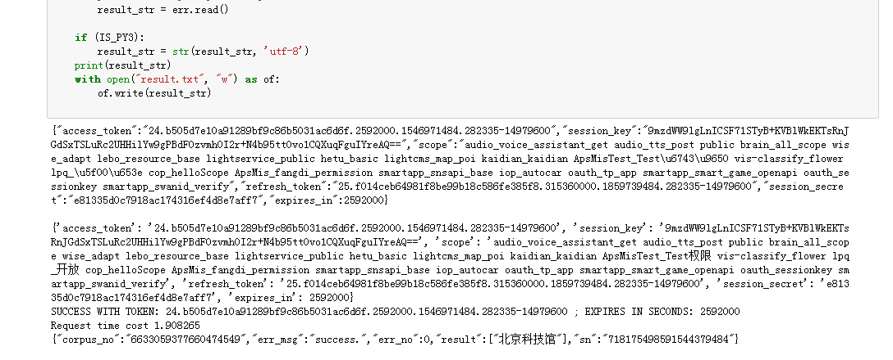
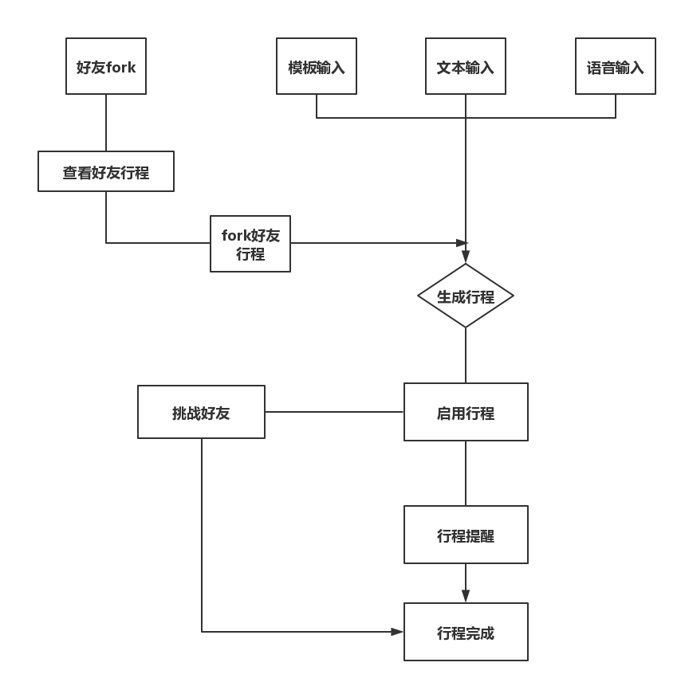

# API_ML_AI：行程APP

|         |            |
| ------------- |:-------------:|
| Target release     | 12月30日 |
| Epic      |  小程同学   |
| Document status | 中后期      |
| Designer        | 蔡泽纯 |
| Developer       | 蔡泽纯 |
| QA | 蔡泽纯  |

##### 加值宣言
• 主要：运用百度语音识别API、百度自定义模板文字识别API做出一款可以为用户简单输入行程计划，有效输出用户行程，并且可以提醒用户行程任务的APP 
• 辅助：另一个游戏化的辅助功能是用request调用微信里面的好友，使用户可以看到好友行程进度的情况，行程一个好友竞争完成度的挑战意识。游戏化的点在于可以通过挑战好友获得积分（APP课程上学到的游戏化思维），通过这个功能增加用户粘性，更有动力地去完成自己的行程任务。 
##### 核心价值
• 最小可用产品：一款帮助用户简单输入行程计划，有效制定行程并且提醒用户有效地、有竞争意识地完成行程任务的APP 
• 着眼于用户的最基本需求，解决用户日常忘记行程计划的问题，帮助用户记住行程并且提醒用户完成行程，通过好友行程进度提醒，促进用户竞争完成自己的行程挑战自己 
• 另一方面，小程同学APP可以通过语音输入、图片输入、文字输入三种方法进行行程设置，也可以直接在系统内直接模板套用进行行程设置，符合现在的行程助手功能，而且方便快捷。 
•	用户案例：每个人每天要做的事很多，但是很容易会忘记我到底要做什么，而且一年有365天，你可能不记得哪一天是谁的生日，你需要一个备忘录，提醒你这些事情。 
• 小程同学是一个很简单的APP，你在每一年输入要做的大事，如哪一天是谁的生日或者哪一天是四六级考试，他可以在这些节点上提示你或者你在前一天晚上输入第二天大致要做什么，他会提示你第二天的行程安排，并且可以语音播报  
##### 加值与用户痛点
• 现在生活节奏很快，而且事情可能很琐碎，有时候可能想要给自己充会电，学习一项新的技能，但是总是无法坚持到最后，这都是源于没有一个好的计划，好的计划是成功的一半，当然有了好计划，实行也是同等重要，如果没有实行，那么再好的计划也是白搭，所以我们需要一个帮用户记住行程并且提醒用户行程的APP   
• 目前很多人对自己的态度总是得过且过的，每天很忙碌，但不知道自己做了什么，只觉得累还有觉得也是值得的，但其实产出并不能达到预期，针对这一点，需要有一个东西来帮助我们更好更有效率地做事，行程APP中有行程规划和提醒实现的功能，并且操作简单，其中还有调用微信库的功能，可以帮助我们更好更有效率地完成工作  
### 用户
所有想要提醒自己按时完成任务的人，如：懒癌晚期、拖延症重度患者、健忘的人
##### 用户画像
• 蔡泽纯：大学生，想要考过六级，每次一考完六级就说下次要做个完美计划去复习六级，但每次都是做好计划丢在一边，最后又没过六级，此用户有目标，但是做好的计划没能随身带着，他不知道自己定的计划应该分散慢慢做，他需要小程同学每天提醒他该复习六级了  
• 黎蝉：大学生，拖延症重度患者，每次都说自己有一堆作业，从早上起床后就开始坐在电脑前，开始打开阿雪的作业，然而舍友说要一起买美特斯邦威的衣服，他就逛起了淘宝，然后作业一拖再拖，最后一刻才真正能提交  
• 卢佳燕：大学生，每天卢佳燕总是在别人做作业的时候，“你们在做什么，啊！！！有作业！！？？？我怎么不知道”，这是一个很健忘的人，特别是作业，但是他又会立马投入去做，最后成品总是在中等水平，现在他有了小程同学，这次的API作业，他在小程同学上录入模板，开始提示，从14周开始他每天做一点，现在已经做了一大半了，看来这次作业可以更上一层楼了  
##### 人工智能概率性与用户痛点
• 自定义模板文字识别API的准确率达到95%，如果再进行训练集、测试集可以达到100%，属于精确性范畴，用户上传模板照片，可以达到100%，基本不会出现识别错误，另外一点是自定义模板文字识别API对于手写汉字的识别准确率达到98%，这与简单输入或者已有手写模板相切合(百度AI平台给出的评价)  
• 语音合成和语音识别的技术在市面已经趋向于100%，在小程同学中，我选取的百度语音识别，但是有更好的技术的时候我会再改进，保证用户在输入语音或者文本时能够尽量达到100%准确。
### 市场竞争对手分析
##### 手机系统自带的备忘录、行程助手APP
• 手机系统自带的备忘录里面功能单一，没有像小程同学一样多功能，其次小程同学拥有微信好友竞争功能，有趣味性和竞争性，能够更好地帮助用户完成行程任务  
• 行程助手这类型的APP都是专注于某一项事物，很有针对性，比如说旅游行程APP，着重于旅游行程的计划，跟小程同学所针对的领域不同，而且旅游行程没有像小程同学一样拥有微信好友竞争功能，有趣味性和竞争性，所以小程同学行程助手很有必要出现
### Goals: 
• 做一款可以为用户记住行程并且提醒用户行程的APP  
##### 前期目标
• 完成静态原型图，思考可行性，写出大致的PRD(35%）  
##### 中期目标
• 做出APP的流程图，并且评估进度，调查市场竞争力，寻找更好的方案及其用户核心价值点和痛点，尝试使用百度API(70%)  
##### 后期目标
• 做出APP的思维导图、地图，完善交互原型图，运用百度API，做出Web APP雏形。（95%）
### Background and strategic fit: 
• 在现实生活中，我们总是想要实现自己的价值，价值这种东西摸不到够不着，但是有时候我们需要一些实际完成的东西，来证明我们确实做过，就像我们复习四六级，如果你没做好计划，等于白搭，所以好的计划是成功的一半，但是实施也是灵魂的重点，只有好计划加上行动力，才能有98%的成就，行程APP可以帮助我们更好更有效率地完成一项小指标。  
• 我在平时学习上不够自律，每一次作业都拖到最后，而且经常有些茫然。有时有些朋友生日我会忘记，容易淡化友谊，这款APP我觉得对很多人来说都是需要的，帮忙做好行程，并为你规定计划会让你更有效率地完成一件事  
### Assumptions: 
|    Assumptions     |       Answer     |
| ------------- |:-------------:|
|   为什么用户要使用这个软件？      |   用户想想要更有效率地完成工作   |  
|   为什么用户想要有语音输入功能      |   用户想更加简单方便，懒得编辑   | 
|   什么样的人会使用这个软件？      |   所有想要提醒自己按时完成任务的人   | 
|   用户会在什么情况下使用这个软件？      |   用户需要一个监督提醒自己的机器助手   |  
|   为什么用户想要看好友的任务行程进度      |   好奇？竞争才能更有兴趣想做   |  
### 需求 Requirements: 
|         |    Title     |       User story     |      Importance     |      Notes     |
| ------------- |:-------------:|:-------------:|:-------------:|:-------------:|
| 1        |   模板输入任务行程    | 用户在笔记本上做好了任务行程想导入在APP中 | 重要 | 百度自定模板语音识别 |  
| 2        |   用户可以语音输入任务行程    | 老年用户不懂得如何打字，但容易忘事，可以直接语音输入 | 重要 | 语音识别API |  
| 3        |   发送任务行程挑战    | 可以查看任务行程进度 | 重要 | request调用微信库 |  
### API
##### 语音识别API
  
代码链接：https://github.com/ziruilin/API_ML_AI/blob/master/语音识别API.ipynb 
https://github.com/ziruilin/python 
##### 自定义模板文字识别API
代码链接：https://github.com/ziruilin/API_ML_AI/blob/master/自定义模板文字识别API.ipynb 
https://github.com/ziruilin/python/blob/master/API2.md
##### 语音合成API
https://github.com/ziruilin/API_ML_AI/blob/master/语音合成API代码.ipynb
##### API使用比较分析
• API1 语音识别API一开始我使用的是百度API，最后我使用的也是百度API，从识别的准确性来看，科大讯飞的语音识别在市场上的认可度比较高，可以达到97%，另外，科大讯飞优势在于大段大段的文字识别上，准确率较高，比较符合我要输入整个行程的想法，但是它没有python的SDK档，所以我做不出，退而求其次使用百度语音识别API 
• API2 自定义模板文字识别API是根据我的一个中期想法进行使用的，这个主要用于懒得再动手一次的用户，有些人把计划写在纸上想把它放在APP上，直接手上传格式类似的图片就可以，而百度的自定义模板文字识别的准确率达到95%，分字段更加准确，相对比阿里云自定义模板更加准确而且更加贴合我的要求。另一方面，在识别区字段类型中新增手写数字识别类型，百度自定义模板文字识别针对手写识别率更高 
##### API使用风险报告
• 百度自有测试集上，准确率由95%左右全部提升到100%，语音识别目前我做的文档需要将录音转化成wav的格式，另外，在讲话声音不大，识别的效果不好，只能达到80%，在这里会给用户带来困扰，特别是那些带口音或者在环境很嘈杂的地方的一些用户，会丢失用户使用信心，后期我打算用讯飞的语音识别API  
• 目前自定义模板文字识别我只做了一个模板，没有普遍化，很多照片不按照模板格式是很难准确识别的  
##### API概率
• 语音识别目前我做的文档需要将录音转化成wav的格式，另外，在讲话声音不大，识别的效果不好，只能达到80%（自查）  
• 百度自定义模板文字识别自有测试集上，准确率由95%左右全部提升到100%（百度AI验证） 
### 使用者交互及设计:
• 产品原型图：https://ziruilin.github.io/API_PT/  
• APP流程图：  
  
• 产品功能结构图：  
  
### 问题 Questions: 
|    Question     |       Outcome     |   
| ------------- |:-------------:|
|   如何用语音输入行程      |   需要使用百度api的语音识别API   |  
|   如何查看好友行程进度      |   需要request调用微信里库   | 
|   如何向好友发送行程任务挑战      |   暂时Not doing   | 
### 不做 Not doing: 列出诗论及记录过的功能，超出范围的功能，下一版再改进的功能，都放在这
• 后期：在做好以上的时候，我想要实现规划行程时可以有多个行程选择  
• 向好友发送行程任务挑战
## 全部附件清单：
语音识别API：https://github.com/ziruilin/API_ML_AI/blob/master/语音识别API.ipynb 
自定义模板文字API：https://github.com/ziruilin/API_ML_AI/blob/master/自定义模板文字识别API.ipynb 
语音合成API：https://github.com/ziruilin/API_ML_AI/blob/master/语音合成API代码.ipynb 
产品原型图：https://ziruilin.github.io/API_PT/  
产品功能架构图：https://github.com/ziruilin/API_ML_AI/blob/master/产品功能架构图.png
产品功能流程图：https://github.com/ziruilin/API_ML_AI/blob/master/flow.png

